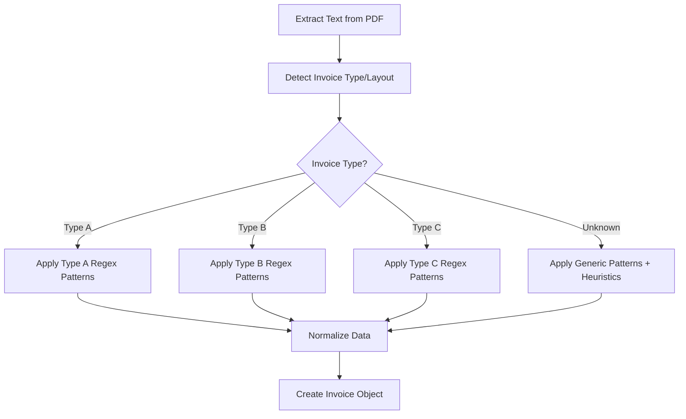
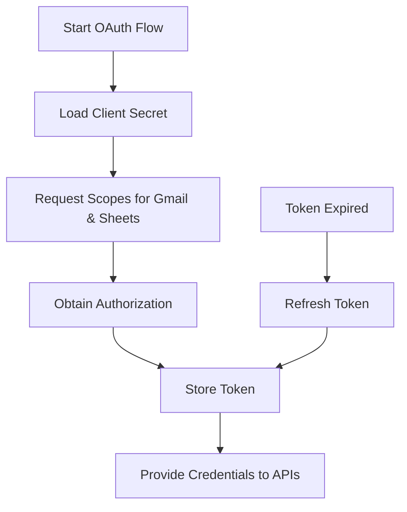
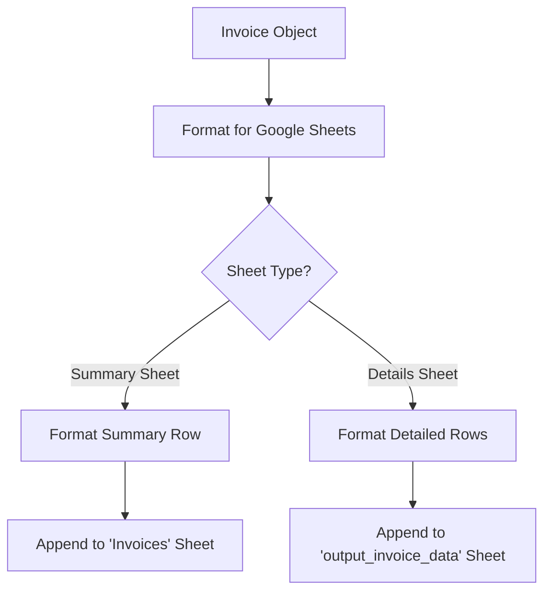

# OCR Invoice Processing Implementation Plan

## Introduction

This implementation plan outlines the approach for developing the OCR invoice processing system. It is organized into three phases, with testing integrated throughout each phase as detailed in the [Testing Strategy](testingStrategy.md) document.

## Phase 1: Foundation & Core Components

### 1. Data Schema Implementation & Normalization
This establishes the foundation for all data processing in the system. The schema has been defined in `dataSchema.md`.

**Tasks:**
1. Update models.py to ensure it fully aligns with the defined JSON schema
2. Implement data validation functions to verify extracted data against the schema
3. Create normalization functions for dates, currency values, and text fields
4. Implement error handling for missing or malformed data
5. Add logging for data extraction and validation issues
6. Create unit tests for validation and normalization functions

### 2. Enhance Invoice Parsing for Layout Adaptability (Critical)
This is a core requirement that affects all processing modes. The current implementation uses basic regex patterns that may not handle different invoice layouts effectively.

**Tasks:**
1. Create a configuration system for regex patterns based on invoice types
2. Implement invoice type detection logic
   based on vendor names or layout patterns
3. Enhance parse_invoice.py to use the appropriate patterns for each invoice type
4. Implement robust line item extraction
   with special focus on table detection
5. Ensure all extracted data is normalized according to the schema requirements
6. Create test fixtures with sample invoices of different formats
7. Implement tests for each invoice type and layout

### 3. Adapt OAuth Flow for Single-User, Dual-API Access
This is a dependency for both Google Sheets and Gmail integration.

**Tasks:**
1. Modify oauth_handler.py to remove multi-user logic
2. Ensure both Gmail and Google Sheets API scopes are requested in a single flow
3. Update token storage to handle both API scopes
4. Adapt oauth_reauth.py for the simplified flow
5. Implement robust error handling for authentication failures
6. Create mock tests for OAuth authentication flow

### 4. Implement Google Sheets Integration
This is required for storing the processed invoice data.

**Tasks:**
1. Update sheets_integration.py to use the adapted OAuth flow
2. Implement functions for formatting invoice data for different sheet types
3. Add error handling and retry logic for API failures
4. Implement batch processing for multiple invoices
5. Create mock API tests for Sheets integration

## Phase 2: Mode Implementation

### 5. Enhance Local PDF Batch Processing (Mode 3)
This is the simplest mode to implement and test.

**Tasks:**
1. Update process_invoices.py to use the enhanced invoice parsing
2. Implement configuration loading from config.json
3. Add logging for processing status and errors
4. Implement parallel processing for better performance (optional)
5. Create integration tests for end-to-end PDF processing

### 6. Implement Gmail Integration (Mode 1 & 2)
This builds on the OAuth and Sheets integration.

**Tasks:**
1. Implement email search and filtering based on configurable criteria
2. Extract basic email information for Mode 1
3. Download and process PDF attachments for Mode 2
4. Implement email labeling and organization
5. Create mock API tests for Gmail integration

### 7. Implement CLI Interface
This provides a user-friendly way to control the application.

**Tasks:**
1. Implement command-line argument parsing
2. Add mode selection logic
3. Implement configuration loading and validation
4. Add progress reporting and error feedback
5. Create tests for command-line argument parsing and mode selection

## Phase 3: Quality Assurance

### 8. Implement Comprehensive Testing
This phase focuses on system-wide testing to ensure the reliability and accuracy of the application, building on the component-level tests implemented in earlier phases.

**Tasks:**
1. Implement end-to-end tests for complete workflows
2. Create regression test suite to prevent regressions
3. Implement performance and stress tests
4. Set up continuous integration for automated testing
5. Implement test coverage reporting
 and monitoring

### 9. Documentation and Deployment
This ensures the application is usable and maintainable.

**Tasks:**
1. Create comprehensive README with setup and usage instructions
2. Document the architecture and design decisions
3. Create user guides for different modes
4. Prepare deployment instructions
5. Verify documentation accuracy through testing

## Implementation Timeline

1. **Phase 1 (Foundation & Core)**: 3-4 weeks
2. **Phase 2 (Mode Implementation)**: 2-3 weeks
3. **Phase 3 (QA & Documentation)**: 1-2 weeks

Total estimated time: 6-9 weeks

## Testing Approach

Testing is integrated throughout all phases of implementation, not just as a final step. Each component will have appropriate tests developed alongside the implementation. See the [Testing Strategy](testingStrategy.md) document for detailed information on how testing is integrated into each phase.